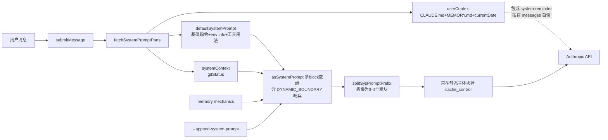
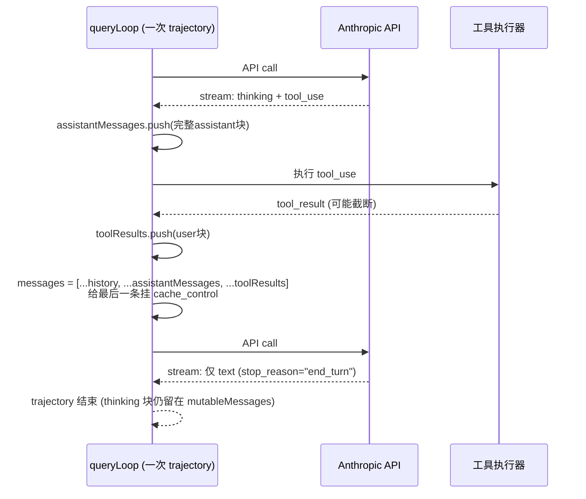
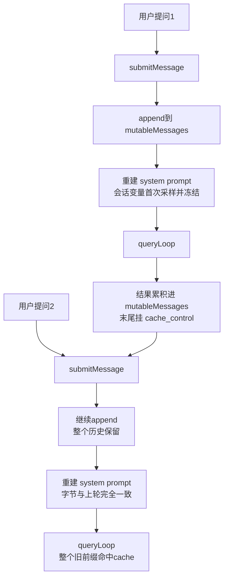
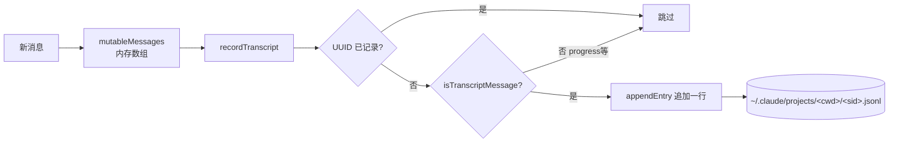
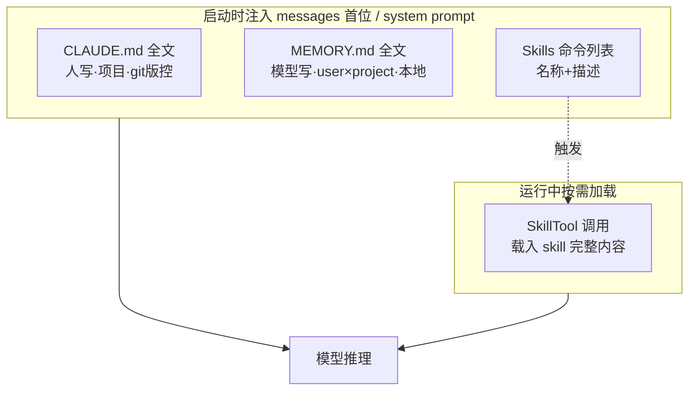
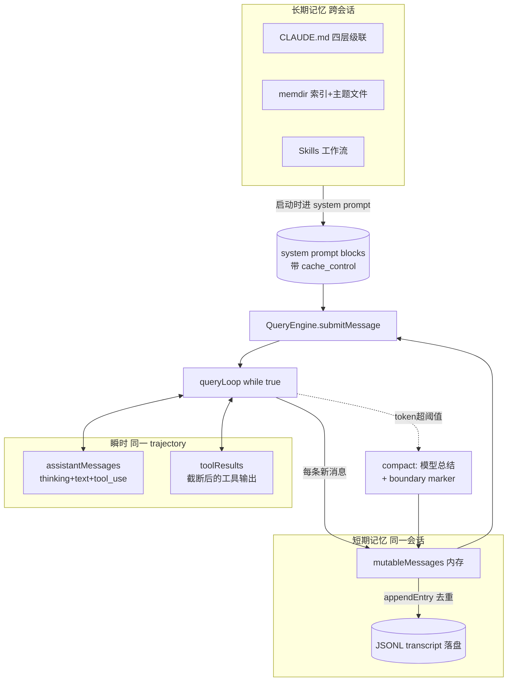

本文基于 `src/` 源码梳理 Claude Code 如何在「一次提问内」、「同一会话多轮」、「跨会话长期」三个时间尺度上管理上下文。

阅读视角是**正常的外部用户**——也就是从 npm 装的标准 Claude Code、没改 feature flag、没启用 Anthropic 内部实验配置的那种使用方式。源码里有不少受 GrowthBook 实验或 `USER_TYPE === 'ant'` 门槛保护的内部路径，本文只在必要时旁注、不当作主流程介绍。

记忆按生命周期分三层：

| 层级 | 载体 | 维护者 | 例子 |
|---|---|---|---|
| **瞬时（同一 trajectory 内）** | `messages` 数组累积 | 引擎 | 工具结果、思考块 |
| **短期（同一会话）** | 内存 `mutableMessages` + 落盘 JSONL | 引擎 | 整轮 transcript |
| **长期（跨会话）** | CLAUDE.md / memdir / skills | 人 + 模型 | 项目规范、用户偏好 |

---

## 0. 前置概念

进入正题前，先约定三个贯穿全文的概念。

### 0.1 Session（会话）

> **从启动 Claude Code 到退出之间的整段时间**——一个 `sessionId`（src/utils/sessionStorage.ts 里随处可见的 `getSessionId()`）唯一标识它。

Claude Code 内部统一用 `session` / `sessionId`（出现 1200+ 次），不用 `conversation`/`conversationId`（仅 14 处，且多在 IDE bridge 协议这种外部接口）。本文档统一沿用源码术语，叫**会话 / session**。

一个 session 内：
- `QueryEngine.mutableMessages` 持续累积，只增不减（除非压缩）
- transcript 落盘到 `~/.claude/projects/<sanitized-cwd>/<sessionId>.jsonl`
- 包含 1 到 N 个 trajectory（每次用户提问启动一个）

三个层级的嵌套关系：

| 术语 | 范围 |
|---|---|
| **API call** | 单次 `messages.create` 调用，由一次 `stop_reason` 终结 |
| **Trajectory** | 一次 user→assistant 完整应答，对应 `queryLoop` 一次完整迭代，可能包含多个 API call |
| **Session** | 整个会话生命周期，同一个 `sessionId` 下所有 trajectory |

### 0.2 Trajectory（轨迹）

> **从用户一次提问到 assistant 给出最终文本答复之间，模型走过的完整路径**——可能包含 N 次 API 往返（model→tool→model→tool→…→model）。

源码注释（src/query.ts:158）的精确定义："a single turn, or if that turn includes a tool_use block then also its subsequent tool_result and the following assistant message"。

例：用户问"看看 src 下有什么文件"→ 模型 thinking + 调 Glob → 模型 thinking + 调 Read → 模型给出最终文本，这一整段是 **1 个 trajectory、3 次 API call**。Thinking 块的"必须保留"硬性要求就是限定在 trajectory 范围内。

### 0.3 Anthropic Messages API 的参数结构

Claude Code 通过 `anthropic.beta.messages.create({stream: true})` 调用模型（src/services/api/claude.ts:1697-1728）。

#### 一份真实请求的 JSON 形态

下面是一次 trajectory 中第二次 API call（已经调过一次 Glob、要继续调 Read）时实际发出的请求长什么样。所有值都是会真出现的形态：

```json
{
  "model": "claude-opus-4-6",
  "max_tokens": 32000,
  "stream": true,
  "temperature": 1,
  "thinking": {
    "type": "enabled",
    "budget_tokens": 16000
  },
  "system": [
    {
      "type": "text",
      "text": "You are an interactive agent that helps users with software engineering tasks. ...\n# System\n - All text you output outside of tool use ...\n# Doing tasks\n ...\n# Using your tools\n ...",
      "cache_control": { "type": "ephemeral", "scope": "global" }
    },
    {
      "type": "text",
      "text": "# Session-specific guidance\n ...\n# auto memory\n...\n# Environment\nPrimary working directory: /Users/jane/myproject\nIs a git repository: true\nPlatform: darwin\n...\ngitStatus: On branch main\nnothing to commit, working tree clean"
    }
  ],
  "tools": [
    {
      "name": "Read",
      "description": "Reads a file from the local filesystem...",
      "input_schema": {
        "type": "object",
        "properties": {
          "file_path": { "type": "string", "description": "The absolute path to the file to read" },
          "offset":    { "type": "integer" },
          "limit":     { "type": "integer" }
        },
        "required": ["file_path"]
      }
    },
    {
      "name": "Glob",
      "description": "Fast file pattern matching tool...",
      "input_schema": { "type": "object", "properties": { "pattern": { "type": "string" } }, "required": ["pattern"] },
      "cache_control": { "type": "ephemeral" }
    }
  ],
  "tool_choice": { "type": "auto" },
  "messages": [
    {
      "role": "user",
      "content": [{
        "type": "text",
        "text": "<system-reminder>\nAs you answer the user's questions, you can use the following context:\n# claudeMd\nContents of /Users/jane/.claude/CLAUDE.md ...\n# currentDate\nToday's date is 2026-05-06.\n\nIMPORTANT: this context may or may not be relevant ...\n</system-reminder>"
      }]
    },
    {
      "role": "user",
      "content": [{ "type": "text", "text": "看看 src 下的代码结构" }]
    },
    {
      "role": "assistant",
      "content": [
        {
          "type": "thinking",
          "thinking": "The user wants to know the code structure under src/. Let me start by listing files with Glob.",
          "signature": "ErUBCkYIBBgCIkBnQHc..."
        },
        {
          "type": "tool_use",
          "id": "toolu_01AbCdEf",
          "name": "Glob",
          "input": { "pattern": "src/**/*.ts" }
        }
      ]
    },
    {
      "role": "user",
      "content": [{
        "type": "tool_result",
        "tool_use_id": "toolu_01AbCdEf",
        "content": "src/index.ts\nsrc/QueryEngine.ts\nsrc/query.ts\nsrc/tools.ts\n... (132 more)",
        "cache_control": { "type": "ephemeral" }
      }]
    }
  ],
  "betas": ["prompt-caching-2024-07-31", "extended-cache-ttl-2025-04-11"],
  "metadata": { "user_id": "anon_abc123" }
}
```

字段速查：

- `model` — 主模型 ID
- `max_tokens` — 本次输出上限（thinking + text + tool_use 总额）
- `stream: true` — 走 SSE，返回 `message_start / content_block_start / *_delta / *_stop / message_stop` 事件流
- `thinking` — 顶层配置（`enabled` / `disabled` / `adaptive`），开了之后 assistant 的 content 才会出现 thinking 块
- `system` — TextBlock 数组（不是字符串、不是 messages[0]），每块可独立挂 `cache_control`
- `tools` — 工具定义（name + description + JSON Schema），可在末位挂 `cache_control` 把整个 tools 列表纳入缓存
- `tool_choice` — `{type: "auto"}` 让模型自己决定调不调；可强制 `{type: "tool", name: "Read"}`
- `messages` — 只有 user / assistant 两种角色，content 是块数组
- `betas` — 启用的 beta header（prompt cache、extended TTL、context management 等）
- `metadata` — 计费与审计字段

#### 和老式 chat_completions 的关键差异

| OpenAI chat_completions | Anthropic Messages |
|---|---|
| system 是 `messages[0]`（role: system） | system 是**顶层独立字段** |
| messages 角色 4 种：system/user/assistant/tool | messages 角色**只有** user 和 assistant |
| content 通常是字符串 | content 是**块数组** |
| tool 结果用 `role: "tool"` 单独消息 | tool 结果用 `role: "user"`，content 含 `tool_result` 块 |
| 不支持 prompt cache 标记 | content 块上挂 `cache_control` |
| thinking 不是一类消息 | thinking 是顶层配置 + 消息里有 `thinking`/`redacted_thinking` 块 |

#### 内容块类型

```ts
content: [
  { type: "text", text: "...", cache_control?: {...} },
  { type: "image", source: {...} },
  { type: "tool_use", id: "toolu_xxx", name: "Read", input: {...} },        // assistant 才有
  { type: "tool_result", tool_use_id: "toolu_xxx", content: "..." },         // user 才有
  { type: "thinking", thinking: "...", signature: "..." },                   // assistant 才有，明文
  { type: "redacted_thinking", data: "..." },                                // assistant 才有，加密 blob
  { type: "document", source: {...} },
]
```

`thinking` 是模型可读的明文思考 + 签名；`redacted_thinking` 是同样的思考被 Anthropic 安全分类器加密后的不透明 blob。**两者结构上对客户端处理一致**：原样保留、原样回传，只是 UI 是否展示文字给用户不同。删改任一会破坏签名链，下次请求 400。

#### 一次 trajectory 的典型 messages

```ts
[
  // prependUserContext 注入的 meta（CLAUDE.md + currentDate）
  { role: "user", content: [{type: "text", text: "<system-reminder>...</system-reminder>"}] },

  // 用户真实提问
  { role: "user", content: [{type: "text", text: "看看 src 下的代码结构"}] },

  // assistant 第一轮
  { role: "assistant", content: [
    { type: "thinking", thinking: "...", signature: "..." },
    { type: "tool_use", id: "toolu_01", name: "Glob", input: {pattern: "src/**"} },
  ]},

  // 工具结果（注意还是 role: user）
  { role: "user", content: [
    { type: "tool_result", tool_use_id: "toolu_01", content: "src/index.ts\n..." },
  ]},

  // assistant 继续 / 终结
  { role: "assistant", content: [
    { type: "thinking", ... },
    { type: "text", text: "我看完了..." },
  ]},
]
```

记住三条：
1. **system 不在 messages 里**，在顶层
2. **没有 role: "tool"**，工具结果以 `tool_result` 块塞进 user 消息
3. **stream: true 不返回单个 BetaMessage**，而是 `message_start / content_block_start / *_delta / *_stop / message_stop` 事件流。Claude Code 自己消费原始 SSE，不用 SDK 的 `BetaMessageStream` 封装（后者解 partial JSON 是 O(n²)）

---

## 1. 首次构建 system prompt

每次会话启动后用户发出第一条消息时，Claude Code 都会现场拼一份 system prompt。这一节看它是怎么拼出来的、为什么要拼成数组形式，以及服务端的 prompt cache 怎么决定哪些段落能被复用。

入口：`src/QueryEngine.ts` 的 `submitMessage()`。

system prompt **不是一段拼接好的字符串，而是一个 block 数组**，便于按 cacheScope 分段；后续会被 `splitSysPromptPrefix` 折叠为最多 3-4 个粗块发送，其中只在 1-2 个块上实际挂 `cache_control`（详见 1.1）。`fetchSystemPromptParts()` 负责拉齐三大块：

- **defaultSystemPrompt**（数组）：进 API `system` 字段。包含基础指令、`# System`、`# Doing tasks`、`# Executing actions`、`# Using your tools`、`# Tone and style`、`# Output efficiency`、env info、`# Session-specific guidance`、auto memory 教程、MCP/scratchpad/语言/输出风格等所有"指令性"内容。工具的 schema 走 API 的 `tools` 字段，但工具的"何时用、怎么用"的指南就是写在这里
- **systemContext**（dict）：通过 `appendSystemContext` 拼成 `key: value` 字符串**追加到 system prompt 数组末尾**。当前实际只有 `gitStatus`（会话开始一次性采样的 git 快照）和可选的 `cacheBreaker`
- **userContext**（dict）：**不进 system prompt**！通过 `prependUserContext` 包成一条带 `<system-reminder>` 的 user message，插在所有真实 user 消息**之前**。包含 `claudeMd`（四层级联拼起来的 CLAUDE.md 全文）和 `currentDate`

之后再追加可选的 memory mechanics prompt（教模型怎么读写 memdir）和 `--append-system-prompt` 用户追加段。block 数组中嵌入了一个哨兵 `SYSTEM_PROMPT_DYNAMIC_BOUNDARY`：边界**之前**是跨用户都能复用的稳定内容（cacheScope=`global`，跨用户共享池细节见 [Appendix A](#a-cachescopeglobal-的跨用户共享细节)），边界**之后**是用户/会话特定信息（cwd、git 快照、当前日期等）—— 注意"会话特定"指的是**跨会话才会变，单个会话内一旦确定就冻结**，因此这部分仍然能跨轮命中缓存。

构建好后，原始 block 数组并不是直接发出去的，而是被 `splitSysPromptPrefix` 折叠成最多 3-4 个粗块（attribution / sysprompt prefix / 静态主体 / 会话变量），其中只有少数几块挂 `cache_control`，原因见下面 1.1。



### 1.1 cache_control 的准确语义

`cache_control` 不是开关，而是**断点标记**(下文可能缩写"断点")：一次模型请求按 `tools → system → messages` 顺序累积前缀，服务端在标记处对累积前缀做哈希、凭哈希查/写缓存。
`cache_control` 的展开形式是 `{type: "ephemeral", ttl?: "1h", scope?: "global"}`（默认 5 分钟 TTL）。

> 关于段落顺序：Anthropic 官方文档定义的拼接顺序是 **tools → system → messages**（tools 在前，因为它通常最稳定）。这条是 API 契约。

关键事实：

1. **命中由服务端前缀比对决定，不是客户端控制的**。客户端只能选"在哪里设断点"，决定哪些前缀长度可被复用。挂在 list 字段某个 element 上 = "以此 element 为终点，从请求开头到这里的整段累积前缀建一个缓存条目"，跨字段累计、不只是 list 内部。
2. **断点之后的内容不进缓存，但不会被丢弃**——按全价 input token 计费、正常参与注意力。
3. **API 上限 4 个断点**，所以不能给每个原始 block 都标。Claude Code 的分配是：
   - tools 末位占 1（把 tools schema 纳入缓存）
   - system 静态主体占 1（scope=`global` 表示跨用户共享，详见 [Appendix A](#a-cachescopeglobal-的跨用户共享细节)）
   - messages 末尾占 1（最新一条 user/tool_result，把缓存边界推到对话当前末尾）
   - 留 1 个机动名额
4. **写比读贵**：cache 写入约普通 input 的 1.25 倍，读取约 0.1 倍。所以并不是断点越多越好——只在能反复命中的位置标。
5. 计费时服务端在 `usage` 里返回 `cache_creation_input_tokens`（写入量）和 `cache_read_input_tokens`（命中量），客户端据此审计。

为什么 Claude Code 把 boundary 放在 system prompt 中段？因为 `cacheScope='global'` 的前缀可被**跨用户共享命中**（不只跨自己的会话）。把所有"跨用户都一样"的内容（基础指令、工具用法手册）挪到 boundary 之前打全局断点，能让冷启动的新会话第一轮就吃到别人写好的缓存。具体共享条件（什么样的用户算"同池"、版本变更如何 invalidate 缓存）见 [Appendix A](#a-cachescopeglobal-的跨用户共享细节)。

> **公开性提示**：本节中"前缀模型 / 断点 / 最长匹配命中 / 4 个上限 / TTL / 段落顺序" 都是 Anthropic 官方 prompt caching 文档里写明的 API 契约。"哈希算法是 Blake2b" 这种实现细节来自 Claude Code 内部源码注释（src/constants/prompts.ts:347），可作直觉参考但**不是官方承诺**——不要让生产代码依赖具体哈希函数或字节级布局。

### 1.2 示例：block 结构骨架

只展示**逻辑 block 顺序和职责**，每块内容真实样貌看 1.1 提到的 `getSystemPrompt()`。

```
system 字段（按 cacheScope 分两段）:
─ 静态段（cacheScope='global'，跨用户共享） ─────────────
  Block 1   getSimpleIntroSection         身份 + URL 安全声明
  Block 2   getSimpleSystemSection        # System：输出/权限/system-reminder 规则
  Block 3   getSimpleDoingTasksSection    # Doing tasks：编码原则
  Block 4   getActionsSection             # Executing actions with care
  Block 5   getUsingYourToolsSection      # Using your tools
  Block 6   getSimpleToneAndStyleSection  # Tone and style
  Block 7   getOutputEfficiencySection    # Output efficiency
─ ⬇ 哨兵 SYSTEM_PROMPT_DYNAMIC_BOUNDARY（拼接时去掉、不发送） ─
─ 会话变量段（cacheScope=null，会话内冻结） ──────────────
  Block 8   getSessionSpecificGuidanceSection   # Session-specific guidance
  Block 9   loadMemoryPrompt                    # auto memory 教程（仅指导写法；MEMORY.md 内容走 messages[0]）
  Block 10  computeSimpleEnvInfo                # Environment（cwd/git/平台/模型 ID）
  Block 11  MCP 服务器指引 / scratchpad 用法 / 旧工具结果清理（FRC = Function Result Clearing）/ 工具结果总结约定
  Block 12  appendSystemContext                 gitStatus: <一次性快照>

messages 字段:
  msg[0]    prependUserContext 注入的 meta（isMeta=true）
            <system-reminder>
              # claudeMd
              <四层级联拼起来的所有 CLAUDE.md + MEMORY.md 内容>
              # currentDate
              Today's date is 2026-05-06.
            </system-reminder>
  msg[1]    真实 user 消息："帮我看看 src 下的代码结构"
```

发出去前 `splitSysPromptPrefix` 会把 12 个逻辑 block **折叠成最多 4 个粗块**：attribution header / sysprompt prefix / 静态主体合并（1-7） / 会话变量合并（8-12）。只有静态主体那块挂 `cache_control={scope:'global'}`。

**三个易看漏的点**：

- **CLAUDE.md 不在 system 里、在 messages[0]**——因为它因项目而异且可能很长，挂在 messages 段能进入末位 cache_control 的覆盖范围
- **gitStatus 在 system 末尾**但会话内冻结，不破坏跨轮缓存
- **env info 在 boundary 之后**——cwd 跨会话会变但会话内不变 → 跨轮可命中、跨会话不命中

---

## 2. 同一 trajectory 内的内容保留

system prompt 拼好之后，下一个问题是：用户的一次提问触发了多次 model→tool→model 往返时，引擎在两次模型调用之间是怎么累积消息的？这一节就关注这个 trajectory 内部循环。

入口：`src/query.ts` 的 `queryLoop`（一个 `while (true)` 的 async generator，一次完整迭代对应一个 trajectory）。

一次用户提问可能触发 N 次 API call（model→tool→model→tool→…→model）。在 trajectory 内部**只追加、不删除**：

- 每次 streaming 结束后，assistant 的 **thinking、redacted_thinking、text、tool_use** 块全部完整压入 `assistantMessages`
- 每个 `tool_use` 触发的 `tool_result`（可能被 `maxResultSizeChars` 截断）按到达顺序累入 `toolResults`，作为一条 user 消息块
- 进入下一次 API call 时，新 messages = `[...messagesForQuery, ...assistantMessages, ...toolResults]`
- 最后一条 user 消息（即最新的工具结果块）上挂 `cache_control`，把 cache 边界一直推到本次 API call 末尾，下一次调用就能命中前面所有内容

关于 thinking 块**跨 trajectory 怎么处理、为什么用户看不见、和 DeepSeek 等 reasoning model 策略的对比**——这些是独立话题，整理在 [Appendix B](#b-thinking-块的处理细节)。一句话先说结论：Claude Code 默认跨 trajectory 也保留 thinking 块，且默认让用户在 UI 上看不见。



---

## 3. 多轮对话（用户继续追问）

第 2 节看的是单个 trajectory；这一节扩到 session 维度——用户在同一会话里连问三五次，引擎是怎么把上一轮的整条 trajectory 接进新一轮的。重点是缓存命中率，因为这是 agent 场景下最关键的成本控制项。

`QueryEngine` 实例持有一个 `mutableMessages` 字段，整个会话期间**只增不减**（除非触发压缩）。每次新的用户提问只是往尾巴追加一条 user 消息，再启动一次 `queryLoop`。

但 system prompt **每轮都重新构建一次**——常态下内容**逐字节一致**，但有几个明确定义的"会变"路径需要点出：

- **跨用户稳定部分**（基础指令、工具用法）：boundary 之前，scope=`global`，跨用户都能命中（共享池定义见 [Appendix A](#a-cachescopeglobal-的跨用户共享细节)）
- **会话特定部分**（cwd、git 快照、CLAUDE.md/MEMORY.md、模型 ID、日期）：boundary 之后，**会话开始时一次性采样并冻结**——`getUserContext`/`getSystemContext` 都被 `memoize` 包过（src/context.ts:116/155），整个会话生命周期内重复调用拿到同一个对象。git status 注释明确写过 "this status is a snapshot in time, and will not update during the conversation"
- **常态下** system prompt 在第 N 轮和第 N+1 轮**字节完全一致**，加上历史 messages 是上一轮的严格超集 → **从 tools 一直到上一轮最末尾的 tool_result，整个累积前缀都能跨轮命中缓存**，唯一不命中的是本轮新增的尾巴
- `discoveredSkillNames` 之类的"本轮发现"集合在 `submitMessage` 入口被重置；轮序号 `turnCounter` 递增（仅用于内部追踪，不进 prompt）

#### 例外：会话内 system prompt 真正会变的场景

源码里有两类**故意不缓存**的写法，承认了少数变化路径：

1. **MCP server 中途连/断**（src/constants/prompts.ts:513-520）：mcp_instructions block 用 `DANGEROUS_uncachedSystemPromptSection` 包装，每轮都重新计算。注释原话："MCP servers connect/disconnect between turns"。当用户中途 `/mcp` 连了新服务器，下一轮 system prompt 这块就变 → 后面所有 cache breakpoint 全 miss
2. **手动 cache breaker**（src/context.ts:29-33）：`setSystemPromptInjection()` 显式清掉 `getUserContext` 和 `getSystemContext` 的 memoize 缓存，并把一段 `[CACHE_BREAKER: ...]` 注入 systemContext。这是 ant-only 的内部 feature flag（BREAK_CACHE_COMMAND），生产用户基本不会触发

除此之外（feature flag 中途翻转、`/output-style` 切换风格等也理论可能影响）都属于**罕见路径**——对绝大多数会话来说，system prompt 字节流就是字面意义上的"一次冻结、整会话不变"。

每条消息都带 `uuid` 与 `parentUuid`，形成一条单向链表，便于 transcript 回放和 compact 边界跨越。



---

## 4. 短期消息的存储

前面三节关注的是**模型当下看到什么**；这一节看的是**会话产生的所有消息怎么落地**——既要给当前会话用，也要支持事后回放、resume、跨 compact 边界回溯。

入口：`src/utils/sessionStorage.ts`。**双层存储**：

- **内存层**：`QueryEngine.mutableMessages`（给模型用的 `Message[]`）
- **磁盘层**：JSONL 落盘到 `~/.claude/projects/<sanitized-cwd>/<sessionId>.jsonl`，每条消息一行

落盘记录（`TranscriptMessage`）字段比给模型的消息**多一层会话元数据**：

- 内容：`type`、`message`/`content`、`uuid`
- 链：`parentUuid`、`logicalParentUuid`（跨 compact 边界用）
- 会话：`sessionId`、`cwd`、`gitBranch`、`timestamp`、`version`
- 来源：`userType`、`isSidechain`（是否 subagent 侧链）、`agentId`、`agentName`、`promptId`（关联 OpenTelemetry / OTel 追踪 ID）

写入是**及时追加**：每收到一条就 `appendEntry`，并通过内存里的 UUID 缓存去重，避免重复落盘。一些只用于 UI 状态的消息（如 progress）会被 `isTranscriptMessage()` 类型守卫过滤掉，不入磁盘。



### 4.1 JSONL 文件样本

用户问"列出 src 文件"、模型调一次 Glob 给出答复，落盘大致长这样（每行一条记录，为方便阅读这里换行展开）：

```jsonl
{"type":"user","uuid":"a1b2c3d4-...","parentUuid":null,"sessionId":"01HXY...","cwd":"/Users/jane/myproject","gitBranch":"main","version":"1.0.42","timestamp":"2026-05-06T08:30:11.123Z","userType":"external","isSidechain":false,"promptId":"prm_xxx","message":{"role":"user","content":"列出 src 文件"}}
{"type":"assistant","uuid":"b2c3d4e5-...","parentUuid":"a1b2c3d4-...","sessionId":"01HXY...","cwd":"/Users/jane/myproject","gitBranch":"main","version":"1.0.42","timestamp":"2026-05-06T08:30:12.456Z","isSidechain":false,"message":{"role":"assistant","content":[{"type":"thinking","thinking":"...","signature":"ErU..."},{"type":"tool_use","id":"toolu_01","name":"Glob","input":{"pattern":"src/**"}}]}}
{"type":"user","uuid":"c3d4e5f6-...","parentUuid":"b2c3d4e5-...","sessionId":"01HXY...","cwd":"/Users/jane/myproject","gitBranch":"main","version":"1.0.42","timestamp":"2026-05-06T08:30:12.789Z","isSidechain":false,"message":{"role":"user","content":[{"type":"tool_result","tool_use_id":"toolu_01","content":"src/index.ts\nsrc/QueryEngine.ts\n..."}]}}
{"type":"assistant","uuid":"d4e5f6g7-...","parentUuid":"c3d4e5f6-...","sessionId":"01HXY...","cwd":"/Users/jane/myproject","gitBranch":"main","version":"1.0.42","timestamp":"2026-05-06T08:30:14.012Z","isSidechain":false,"message":{"role":"assistant","content":[{"type":"text","text":"src 下主要有这几个文件: ..."}]}}
```

要点：

- 每行一个独立 JSON 对象，**无逗号、无外层数组**——纯 JSONL，可以 `tail -f` 实时追
- `parentUuid` 链：第 1 条 `null`（会话起点）→ 后续每条指向上一条
- 同一 trajectory 4 条记录**共享 sessionId、cwd、gitBranch、version**，但每条都重复存一份（方便单行解析、不依赖上下文）
- `tool_result` 是 `role: "user"`，但 `parentUuid` 指向上一条 assistant，形成"assistant 调工具 → user 块装结果"的因果链

---

## 5. 上下文压缩

会话拉得越长，messages 越长，迟早会顶到 context window 上限。这一节看 Claude Code 怎么用三种不同力度的"压缩"机制把会话从悬崖边拉回来——其中两种是常态运行，一种是真出事时的兜底。

入口：`src/services/compact/`。共**三条独立路径**：

| 路径 | 触发 | 行为 |
|---|---|---|
| **手动 `/compact [指令]`** | 斜杠命令 | 模型生成结构化总结，可带自定义指令 |
| **自动 auto-compact** | token 用量超阈值（context window − 13K buffer，再往前 20K 处会先出黄色 warning） | 同上但无自定义指令；可被环境变量 `DISABLE_AUTO_COMPACT` 关闭；连续失败 3 次熔断 |
| **prompt-too-long 应急** | API 返回会话过长错误 | 不调模型，直接剥离尾部消息（reactive）或丢弃头部最旧 round（最多 3 次重试） |

前两条都会发起一次**fork 的 agent 调用**，让模型按 9 段结构化模板（用户主要意图、关键概念、文件与代码、错误修复、问题解决、所有用户消息、待处理任务、当前工作、下一步）写一份 `<analysis>` + `<summary>`。回写后 messages 形态变为：

```
[boundary marker, 总结消息, 保留的最近若干条原始消息, 重新注入的 attachments, session-start hook 输出]
```

`boundary marker` 是一条 `SystemCompactBoundaryMessage`，记录压缩前 token 数和已发现工具集，是 compact 前后的"接缝"。压缩后还会跑 `runPostCompactCleanup()`，清掉 file-read 缓存和 sentSkillNames，让模型在新上下文里重新读关键文件。

```mermaid
flowchart TD
    subgraph 触发
        U1[/compact 命令] --> M[手动路径]
        TK[token 超阈值] --> A[自动路径]
        ER[API: too long] --> R[应急路径]
    end

    M --> CC[compactConversation<br/>fork agent 调用]
    A --> CC
    CC --> SUM[模型生成 9段结构化总结]
    SUM --> BM[buildPostCompactMessages]
    BM --> NEW[boundary marker<br/>+ 总结消息<br/>+ 最近N条原文<br/>+ attachments<br/>+ hook输出]

    R --> RC{reactive 可用?}
    RC -->|是| TAIL[剥离尾部重试]
    RC -->|否| HEAD[丢弃头部最旧 round<br/>最多3次]
    HEAD --> FAIL[仍失败 → 报错让用户回退几条]
```

---

## 6. 长期记忆

前 5 节都在讨论会话生命周期内的事；这一节才是真正"跨会话"的部分——下次启动 Claude Code 时，哪些信息还能找到？答案是三种机制并存：人写的项目规则、模型写的事实笔记、可调用的工作流定义。

入口：`src/utils/claudemd.ts` + `src/memdir/`。三种机制并存：

### 6.1 CLAUDE.md（人写、项目级）

四层级联，按优先级递进合并：

- **Managed**：`/etc/claude-code/CLAUDE.md`（企业通过 MDM / 设备管理系统推送的强制规则）
- **User**：`~/.claude/CLAUDE.md`（用户全局）
- **Project**：`./CLAUDE.md` 或 `./.claude/CLAUDE.md`（仓库 git 检入）
- **Local**：`./CLAUDE.local.md`（项目内私有）

启动时从 cwd 向上遍历到根，沿途收集所有 CLAUDE.md。支持 `@include` 指令递归引入外部文件（深度限 5），HTML 注释会被剥掉，frontmatter 的 `paths:` 字段可以让某些规则只对部分目录生效。最终拼成一个独立 system prompt block。

### 6.2 memdir / Auto Memory（模型写、user × project）

隔离维度是 **user × project**——路径 `~/.claude/projects/<sanitized-git-root>/memory/` 同时按用户和项目分桶。同一项目里你和同事各有一份，互不可见，和 CLAUDE.md project 层"团队 git 共享"形成对比。

```
~/.claude/projects/<sanitized-git-root>/memory/
├── MEMORY.md          ← 索引（≤200行/25KB）
├── user_xxx.md        ← 各主题独立文件
├── feedback_xxx.md
├── project_xxx.md
└── reference_xxx.md
```

设计要点：

- **索引 + 主题文件分离**：`MEMORY.md` 只放一行条目（`- [Title](file.md) — hook`），主题细节在独立文件里
- **没有专用写工具**：模型用通用 Write/Edit 工具自己读写，靠 system prompt 里的"auto memory"教程教它怎么做
- **四种类型**：`user`（角色偏好）、`feedback`（行为修正）、`project`（项目背景事实）、`reference`（外部系统指针）
- **加载方式（默认）**：完整的 `MEMORY.md` 内容随 CLAUDE.md 一起被注入到 messages[0] 的 user-context block 里；system prompt 只放"auto memory"教程教模型怎么读写，不放 MEMORY.md 内容本身。注意：源码里还有一条按需选择的路径（`findRelevantMemories` + Sonnet 选最多 5 条相关主题文件），但受 GrowthBook 实验 flag 控制，默认对外部用户**不开**

这是 CLAUDE.md 不能做到的：跨会话学习、自演进、模型可写、且每用户一份。

### 6.3 Skills（可调用工作流）

`src/skills/` 与 `src/commands.ts`。三处来源：bundled（编译进二进制）、`~/.claude/skills/` 与 `./.claude/skills/` 下的 Markdown、plugin 提供。

Skills 严格说不算"记忆"，更像**长期沉淀的工作流**：可被 `SkillTool` 调用、由模型按描述匹配触发。例如公开可用的 `/init` skill 会扫描代码库初始化一份 CLAUDE.md。

### 三者对比



| 维度 | CLAUDE.md | Auto Memory | Skills |
|---|---|---|---|
| 维护者 | 人 | 模型 | 人 / 模型 |
| 范围 | 项目级（团队共享） | user × project 二维矩阵（用户私有 × 按项目分桶） | 全局或项目 |
| 持久化 | git 检入 | `~/.claude/projects/.../memory/` | Markdown 文件 |
| 加载 | 启动注入 messages 首位 | 启动注入 messages 首位（与 CLAUDE.md 合并） | 名称 eager + 内容 on-invoke |
| 信息流 | 人 → 模型 | 模型 ↔ 模型 | 模型 → 工具调用 |

---

## 一图总览



记住几条主线即可：

1. **思考块在 trajectory 里只增不减** —— Claude 4 thinking API 的硬约束
2. **system prompt 是 block 数组，不是字符串** —— cache 边界靠这个划分
3. **transcript 落盘字段比模型见到的更丰富** —— sessionId、parentUuid 是回放和 compact 跨界的关键
4. **压缩是 fork 一次模型调用做总结** —— 不是简单截断，所以会有 9 段结构化模板
5. **长期记忆 = CLAUDE.md（人写）+ memdir（模型写）+ skills（工作流）** —— 三者互补不互替

---

## Appendix

### A. `cacheScope='global'` 的跨用户共享细节

正文多处提到 system prompt 静态段挂 `cacheScope='global'` 可被"跨用户共享命中"。这里把"和谁共享、能不能保证命中"展开。

#### 共享条件：字节流必须完全一致

`cacheScope='global'` 只是 opt-in 信号，真正能命中靠**两个用户该段字节流完全相等**。Claude Code 静态段虽叫"静态"，里面其实有不少分支因素：

| 分支因素 | 触发位置 |
|---|---|
| `USER_TYPE === 'ant'`（Anthropic 内部 vs 外部） | getSimpleDoingTasksSection 多 4 条 bullet |
| Claude Code 版本升级 | 每次发版整个 prompt 文本可能变 |
| `outputStyleConfig`（Output Style 设置） | getSimpleIntroSection 措辞 |
| `enabledTools`（启用了哪些工具） | getUsingYourToolsSection 列出的工具 |
| REPL 模式 / embedded search tools 等 feature flag | 多处 block 内容分支 |
| `feature('PROACTIVE')` / `feature('KAIROS')` | 整体走另一条 prompt 路径 |

#### 真实"共享池"定义

**同一 Claude Code 版本 + 同一 USER_TYPE + 同一组 feature flag/工具配置 + 同一 outputStyle 的所有用户**。

- 外部用户 + 默认配置：池里同时有几十万到几百万人，命中率近乎 100%
- 内部 / 实验配置：池小很多，可能只有内部几百人
- 每次发版静态段字节流变化 → 老缓存全 invalidated → 新池子第一个用户付一次 cache_creation，5 分钟内后续用户命中

#### 安全/隐私

- 共享内容是"所有人都有"的标准 system prompt，不含任何用户私有信息
- CLAUDE.md / MEMORY.md / git status 都在 boundary 之后（`cacheScope=null`），不进跨用户池
- `attribution header`（账单/客户标识）显式标 `cacheScope=null`（src/utils/api.ts:389），避免缓存条目绑到特定计费实体
- 即使存在 cache timing side channel，能探出来的只是"标准 system prompt 静态段最近请求频率"，是公开内容

### B. Thinking 块的处理细节

#### B.1 跨 trajectory 保留策略

trajectory 内的保留是 **API 硬性要求**，但 Claude Code 实际把保留范围扩展到了整个会话——**默认情况下，前几个 trajectory 的 thinking 块也跟着每轮请求一起传给模型**。

| 层面 | 同一 trajectory 内 | 跨 trajectory（同一会话） |
|---|---|---|
| **Anthropic API 强制要求** | 必须保留：删改 thinking/redacted_thinking 会破坏签名链 → 400 | 不强制：trajectory 结束后 thinking 块"过期"，删了也不会 400 |
| **Claude Code 默认行为** | 全保留 | **也全保留**——不主动剥离 |

source 注释（src/query.ts:158）原话："Thinking blocks must be preserved **for the duration of** an assistant trajectory..."——只规定下界，没规定上界。Claude Code 选择"超额完成"的理由：保护 prompt cache（剥离会改变字节流、跨轮全 miss）+ 模型可能受益于历史推理 + 代码简单（不维护 trajectory 边界检测）。

**真正会剥离的两个场景**（入口：`src/utils/messages.ts:5066` 的 `stripSignatureBlocks()`），共同特征是**signature 失效、留着也没用**：

- **`/login` 切换凭证**（commands/login/login.tsx:24）：thinking signature 绑定到生成时的 API key，切 key 后旧 signature 校验失败
- **fallback 到其他模型**（query.ts:924-928）：thinking signature 也绑定到具体模型，主模型挂 fallback 到 opus 时旧 signature 不被认。注释原话："Thinking signatures are model-bound: replaying a protected-thinking block to an unprotected fallback 400s."

**几个不是"跨轮丢弃"的清理操作**（normalizeMessagesForAPI 内部）：

- `filterTrailingThinkingFromLastAssistant`（src/utils/messages.ts:4781）：assistant 消息不能以 thinking 块结尾（API 规则 2），streaming 中断时会有这种状态，需要修
- `filterOrphanedThinkingOnlyMessages`（4991 行）：处理 streaming 中断+恢复时产生的"孤儿 thinking 消息"

#### B.2 thinking 为什么大多数时候"看不见"

交互式 Claude Code 默认让用户看不到模型思考内容，**不是因为安全分类器**，而是三层选择叠加：

1. **API 摘要：默认关**——Claude Code 默认发 `redact-thinking-2026-02-12` beta header（src/utils/betas.ts:270-276），告诉 API "别用 Haiku 给思考做可读摘要、给我加密 blob 就行"。理由：摘要只对 `Ctrl+O` transcript 模式有用，多数用户不开
2. **UI 渲染：默认跳过**——普通交互模式下 `redacted_thinking` 块连占位 stub 都不画（src/components/Message.tsx:524-528）
3. **历史折叠**——当前 trajectory 结束后，`hidePastThinking` 把过去的 thinking 块折叠掉（src/components/Messages.tsx:391）。注意这是**纯 UI 行为**，和 API 请求里包不包含旧 thinking 块完全无关，API 那边照传不误

打开方式：

```jsonc
// ~/.claude/settings.json
{ "showThinkingSummaries": true }
```

设了之后 Claude Code 不再发 redact-thinking header → API 返回带 Haiku 摘要的可读 `thinking` 块 → 按 `Ctrl+O` 或 `--verbose` 即可看到。

注意区分两种 `redacted_thinking` 来源：**客户端 opt-in**（上面这个机制，可关闭）vs **服务端 safety 强制**（Anthropic 分类器触发时无视 beta header 强制加密；少见、改不了）。两者在 API 字节流和 UI 上都无法区分。

#### B.3 和 DeepSeek 等 reasoning model 的策略对比

跨 trajectory 保留 thinking 是 Claude 的选择，**不是 reasoning model 的通用做法**。DeepSeek R1 / o1 等走相反路线：跨 trajectory 直接丢掉历史 `reasoning_content`，只保留 final answer 进入下一轮（同 trajectory 内的工具调用仍必须回传，跟 Claude 一致）。

两种选择都合理，取决于四个维度：

| 维度 | 倾向丢弃 | 倾向保留 |
|---|---|---|
| **训练分布** | 训练时历史轮就只保留 final answer（R1 RLHF / 基于人类反馈的强化学习范式） | 训练时 condition 在历史 thinking 上（Claude） |
| **thinking 体量** | 5k-30k token（R1 long-CoT，长链思考） | < 5k token（Claude adaptive） |
| **场景独立性** | 一问一答、轮间弱相关 | Agent 工作流、trajectory 高频强相关 |
| **缓存基础设施** | 缓存价值低，留着不省钱 | prompt cache + signature → 留着 ≈ cache_read 价格 |

**关键判定问题**："这个模型在训练时见过历史 thinking 出现在 context 里吗？" 见过就保留、没见过就丢——再加后三个维度的微调。把任一边策略搬到另一边都会变差：R1 推理时塞回历史 thinking → OOD（out-of-distribution，超出训练分布）且几轮把 32k window 撑爆；Claude 跨 trajectory 丢 thinking → cache 全 miss 且模型预期存在却找不到。

"哪种更好"脱离具体模型没有意义，两种都是匹配自家训练分布 + 应用场景 + 基础设施的局部最优。
